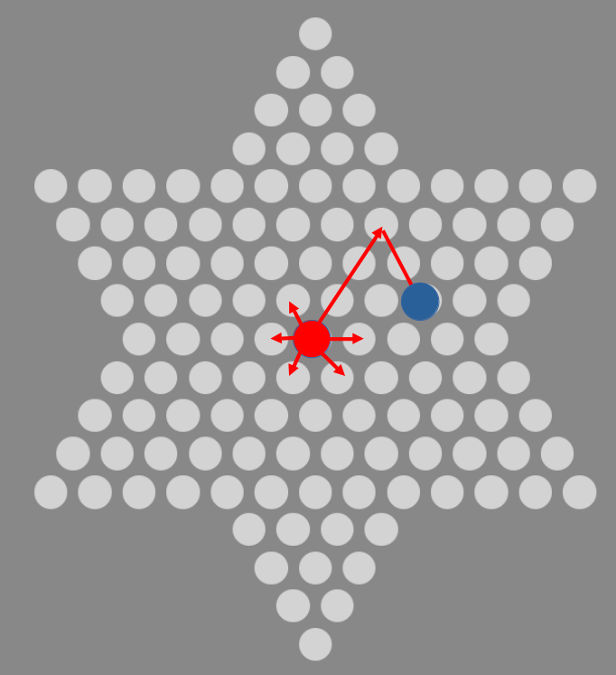

# Chinese Checker Backend
## Description
[Link to play the game](https://cchecker-frontend-stateless.onrender.com/)

[Link to backend code](https://github.com/limlleonard/cchecker_backend)

Chinese Checker is a popular strategy board game in China, it was also my favorite game in my school time. It can be played by 1-6 person. The player try to move all the 10 pieces to the opposite corner of the board. One piece could be moved to an adjacent field or jump over ONE other piece once or for more times, but not jump over more than one piece.

## Play
Start: It will start a new game from the beginning. Old data saved with the same roomnr will be deleted.

Load / Join: It will load a saved game or join the game.

Reset: It will reset the game and delete the record.

Room info: It shows game state saved in database

`<<<`: One step backward

`>>>`: One step forward

## Installation
(You have to start both servers of frontend and backend to test the game locally)

Clone the repo

`https://github.com/limlleonard/cchecker_frontend.git`

Install packages

`cd cchecker_frontend`

`npm install`

Start the server

`npm run dev`

Open a browser and type in: http://localhost:5173/

## Features
By using WebSocket and Djanog Channels, you could play the game with friends remotely

## Components
Frontend is built by React. Backend is built by Django.

Defining each position of the board is a little tricky. They are defined by three numbers.
- First number defines to which direction it goes away from the center. There are six possible directions.
- Second number defines how far it goes away from the center
- Third number defines how far it goes after turning right

The coordinate of the blue point would be (1,3,2)

